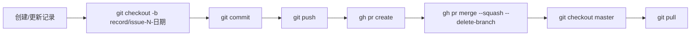

---
name: project-standards
description: 项目标准要求 —— 文件组织规范、命名规范、质量标准、PR 合入规范。
alwaysApply: true
---

# 项目标准要求

## 仓库结构

```
agent-analyze/
├── .codex-plugin/          # Codex 插件（技能文件）
├── .codex/                 # 项目文档
├── scripts/
│   └── daily-check.ps1     # 每日检测脚本
├── targets/                # 目标仓库配置
│   └── *.yaml
├── records/
│   └── issues-log.json     # Issue 记录（通过 PR 合入）
└── README.md
```

## 文件规范

- Markdown 文件遵守 markdownlint 配置
- PowerShell 脚本使用 UTF8 编码
- YAML 配置文件使用 `.yaml` 后缀

## PR 自动合入策略（agent-analyze 自身）

当每日检测创建 Issue 后，记录写入 `records/issues-log.json` 的变更通过 PR 自动合入：



详细规则：
| 项目 | 内容 |
|------|------|
| 分支命名 | `record/issue-<编号>-<时间戳>` |
| commit message | `记录 Issue #<编号> — <仓库名>` |
| PR 标题 | `记录 Issue #<编号> — <仓库名>` |
| 合入方式 | squash merge |
| 合入后自动删除分支 | 是 |
| 触发条件 | 每次创建 Issue 后立即执行 |

这条策略保证 `records/issues-log.json` 的每次变更都有对应的 PR 可追溯。

## Issue 状态同步策略

每日检测时，除了扫描代码，还会检查已记录的 Issue 在目标仓库的状态：

1. 读取 `records/issues-log.json` 中 `solved_at` 为空的记录
2. 调用 `gh issue view` 检查对应 Issue 在目标仓库是否已关闭
3. 若已关闭：自动更新记录中的 `solved_at` 时间戳，并通过 PR 合入

## 学习仓（devops-k8s-agent-roadmap）PR 规范

参见该仓库的 `.github/PULL_REQUEST_TEMPLATE.md`。
